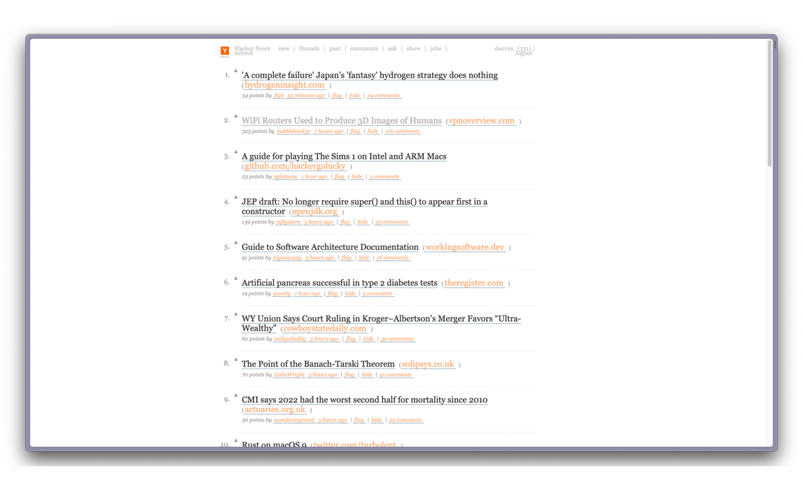
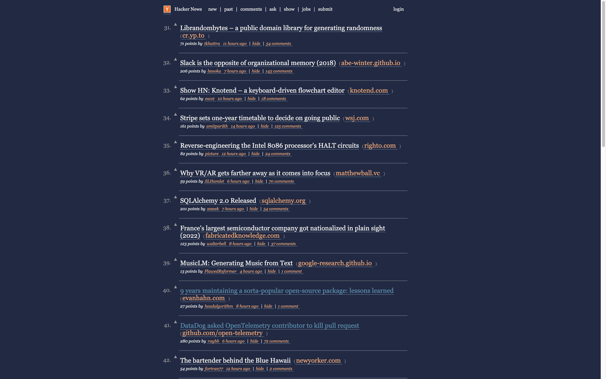

# Georgify Plus! 

Alternate CSS for Hacker News with a focus on typography and readability. 

## Get It

- [Chrome Extension](https://chrome.google.com/webstore/detail/georgify-plus/epgjbcjoloccejgkhkcemagbmmdhlidg)

## Usage

By default, Georgify Plus! will use your system's settings to determine whether to load light or dark mode CSS.
If you need to force a particular setting, right click on the Georgify Plus! extension icon and click the `Toggle Dark Mode` option. 
It will rotate through light, dark and system modes. 

## Features

- ✅ Light mode
- ✅ Dark mode
- ✅ Automatic light/dark mode based on system preference
- ✅ Cloud sync

## About 

Georgify Plus! is an updated version of the [Georgify](https://chrome.google.com/webstore/detail/georgify/ofjfdfaleomlfanfehgblppafkijjhmi) 
that aims to further improve the experience that the original Chrome Extension provided. I have been personally using Georgify since 2013 and
always wished it had a dark mode. [I reached out to the original developer on Twitter in 2022](https://twitter.com/deevus/status/1507628904512917504?s=20)
but had no response. 

From there I decided to "fork" the extension into Georgify Plus!.

## Screenshots

### Light mode

### Dark mode

## F.A.Q.

### Why does Hacker News flash white before enabling dark mode?

If you are using the forced dark mode instead of system setting, there will be a momentary flash of the light mode before the dark mode styles are loaded. 
For best performance, use the system setting. 

### Why is it called Georgify Plus!?

The `Plus!` suffix is an homage to [Microsoft Plus!](https://en.wikipedia.org/wiki/Microsoft_Plus!). 
